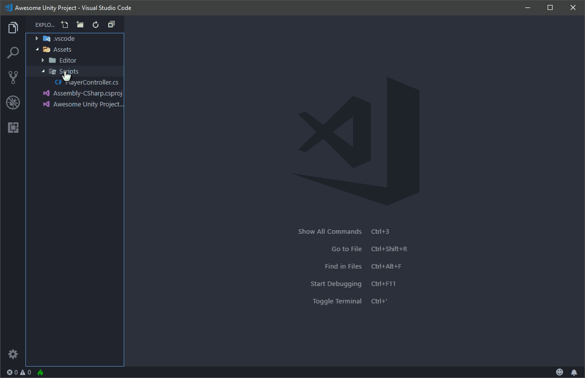
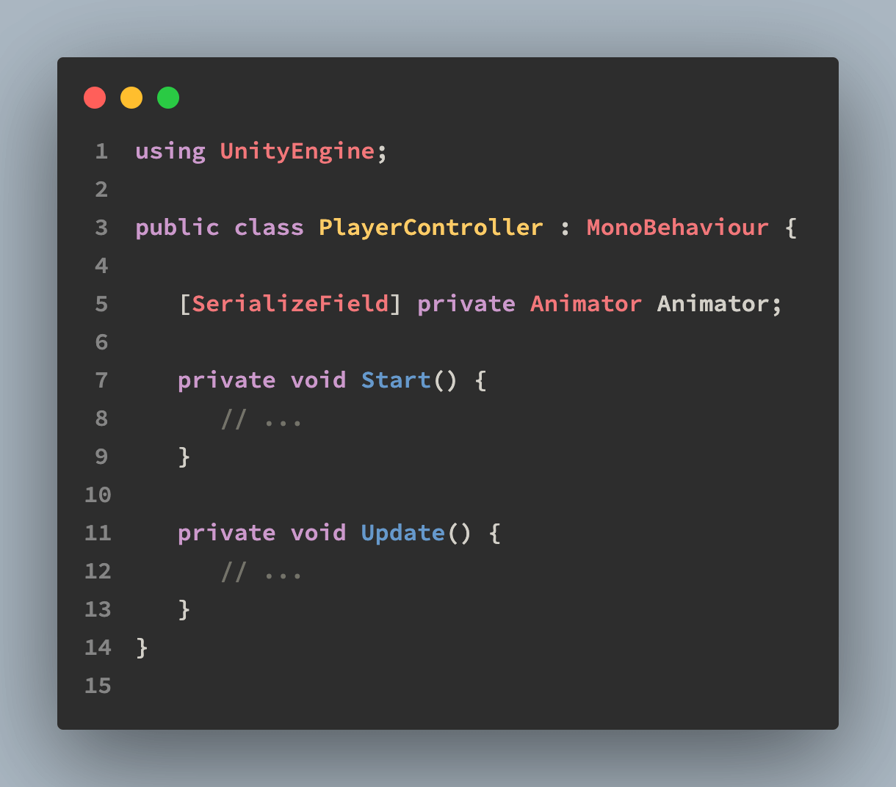
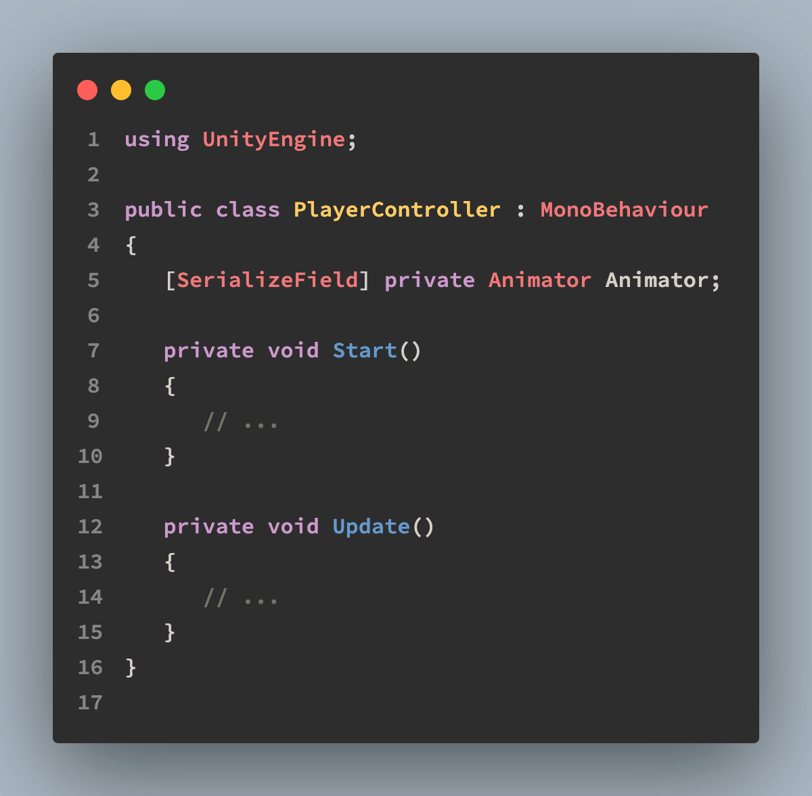
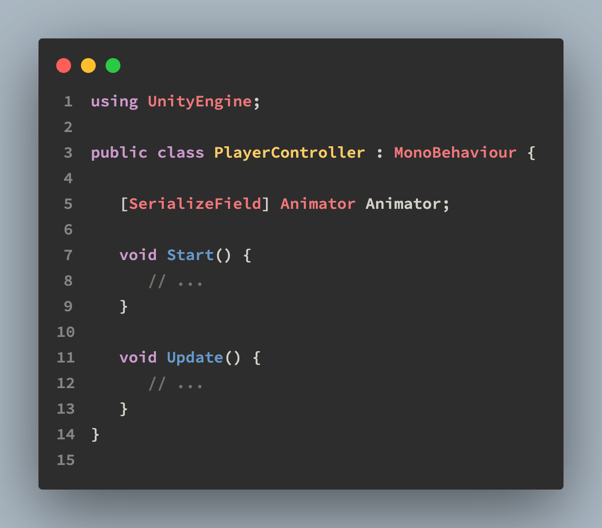

# Unity Code Snippets

Create Unity classes and methods easily.


## Features

> **2.0.0**: Support to style configuration. Now you can use [K&R](https://en.wikipedia.org/wiki/Indentation_style#K&R_style) and [Allman (C#/Unity default)](https://en.wikipedia.org/wiki/Indentation_style#Allman_style) styles! More at [Configuration](#configuration) section.

All the Unity code snippets you need. This extension intends to be the complete collection of Unity snippets for Visual Studio Code.

It takes advantage of latest Visual Studio Code snippets features to create the code faster for you.

### MonoBehaviour

Create game classes like `MonoBehaviours`, `NetworkBehaviours` and `StateMachineBehaviours` easily. Also create common methods like `Start()`, `Update()` or `OnTriggerEnter2D()` and log calls.


### Editor

Create Editor classes like `Editor`, `EditorWindow` and `PropertyDrawer` as easy as it can be.


### ScriptableObject

You never remember the property that goes with the `ScriptableObject` to create it via Unity create menu? Not a problem.



## Installation

As in any Visual Studio Code Extension you have several options to install:

-  Enter the Visual Studio Code Marketplace, search for _Unity Code Snippets_ (or enter directly on [the extension page](https://marketplace.visualstudio.com/items?itemName=kleber-swf.unity-code-snippets)) and click on _Install_ button.
-  Inside Visual Studio Code, enter in the Extensios panel, search for _Unity Code Snippets_ and click on _Install_ button
-  Run the following command in the Command Palette:
   ```
   ext install kleber-swf.unity-code-snippets
   ```

## Configuration

Starting at version `2.0.0` the extension is configurable.

To configure the extension, open VSCode Settings and search for "Unity Code Snippets". Note that after changing any of the settings, you need to restart VSCode to apply them to the snippets.

### Style

The [indentation style](https://en.wikipedia.org/wiki/Indentation_style) for the snippets. For now you can choose between [K&R](https://en.wikipedia.org/wiki/Indentation_style#K&R_style) (the default for 1.x version) and [Allman](https://en.wikipedia.org/wiki/Indentation_style#Allman_style) (default to C#/Unity). If you need a different one, please leave an issue or upvote an existing one at the [project issues bord](https://github.com/kleber-swf/vscode-unity-code-snippets/issues). Default: `K&R`.

#### K&R style



#### Allman style



### Use Private Keyword

Adds the `private` accessor keyword to private members. Default: `true`.

#### No private keyword



### Auto Complete: Classes

Auto complete classes like `MonoBehaviour` and `Editor`.

### Auto Complete: Methods

Auto complete methods like `Start` and `OnCollisionEnter`.

### Auto Complete: Calls

Auto complete utility calls like `Debug.Log` and `Debug.DrawLine`.

### Auto Complete: Attributes

Auto complete attributes like `[SerializeField]` and `[RequireComponent]` (just these two for now).

### Auto Complete: Experimental Attributes

Auto complete all other attributes like `[HideInInspector]` and `[ContextMenu]`. There are a lot o attributes and this can pollute your Intellisense popup.

## All the snippets

Start typing the names to create the corresponding snippet. Some of them have a special snippet to not mess up with the default Intellisense behavior.

Snippets are devided in categories, all of them can be enabled/disabled in the options.

-  Classes:

   -  Game Classes:
      -  `MonoBehaviour`
      -  `StateMachineBehaviour`
      -  `NetworkBehaviour`
      -  `ScriptableObject`
   -  Editor Classes:
      -  `Editor`
      -  `EditorWithReorderableList`
      -  `EditorWindow`
      -  `PropertyDrawer`
      -  `ScriptableWizard`
   -  Standard Classes:
      -  `class`
      -  `interface`

-  MonoBehaviour Methods:

   -  `Awake()`
   -  `FixedUpdate()`
   -  `LateUpdate()`
   -  `OnAnimatorIK()`
   -  `OnAnimatorMove()`
   -  `OnApplicationFocus()`
   -  `OnApplicationPause()`
   -  `OnApplicationQuit()`
   -  `OnAudioFilterRead()`
   -  `OnBecameInvisible()`
   -  `OnBecameVisible()`
   -  `OnCollisionEnter()`
   -  `OnCollisionEnter2D()`
   -  `OnCollisionExit()`
   -  `OnCollisionExit2D()`
   -  `OnCollisionStay()`
   -  `OnCollisionStay2D()`
   -  `OnConnectedToServer()`
   -  `OnControllerColliderHit()`
   -  `OnDestroy()`
   -  `OnDisable()`
   -  `OnDisconnectedFromServer()`
   -  `OnDrawGizmos()`
   -  `OnDrawGizmosSelected()`
   -  `OnEnable()`
   -  `OnFailedToConnect()`
   -  `OnFailedToConnectToMasterServer()`
   -  `OnFocus()`
   -  `OnGUI()`
   -  `OnHierarchyChange()`
   -  `OnInspectorUpdate()`
   -  `OnJointBreak()`
   -  `OnJointBreak2D()`
   -  `OnLostFocus()`
   -  `OnMasterServerEvent()`
   -  `OnMouseDown()`
   -  `OnMouseDrag()`
   -  `OnMouseEnter()`
   -  `OnMouseExit()`
   -  `OnMouseOver()`
   -  `OnMouseUp()`
   -  `OnMouseUpAsButton()`
   -  `OnNetworkInstantiate()`
   -  `OnParticleCollision()`
   -  `OnParticleSystemStopped()`
   -  `OnParticleTrigger()`
   -  `OnPlayerConnected()`
   -  `OnPlayerDisconnected()`
   -  `OnPostRender()`
   -  `OnPreCull()`
   -  `OnPreRender()`
   -  `OnProjectChange()`
   -  `OnRenderImage()`
   -  `OnRenderObject()`
   -  `OnSceneGUI()`
   -  `OnSelectionChange()`
   -  `OnSerializeNetworkView()`
   -  `OnServerInitialized()`
   -  `OnStateEnter()`
   -  `OnStateExit()`
   -  `OnStateIK()`
   -  `OnStateMove()`
   -  `OnStateUpdate()`
   -  `OnTransformChildrenChanged()`
   -  `OnTransformParentChanged()`
   -  `OnTriggerEnter()`
   -  `OnTriggerEnter2D()`
   -  `OnTriggerExit()`
   -  `OnTriggerExit2D()`
   -  `OnTriggerStay()`
   -  `OnTriggerStay2D()`
   -  `OnValidate()`
   -  `OnWillRenderObject()`
   -  `OnWizardCreate()`
   -  `OnWizardOtherButton()`
   -  `OnWizardUpdate()`
   -  `Reset()`
   -  `Start()`
   -  `Update()`

-  Calls:

   -  `Debug.Log()` (type _`log`_)
   -  `Debug.LogError()` (type _`logerror`_)
   -  `Debug.LogException()` (type _`logexception`_)
   -  `Debug.LogWarning()` (type _`logwarning`_)
   -  `Debug.LogFormat()` (type _`logformat`_)
   -  `Debug.LogErrorFormat()` (type _`logerrorformat`_)
   -  `Debug.LogWarningFormat()` (type _`logwarningformat`_)
   -  `Debug.DrawLine()` (type _`drawline`_)
   -  `Debug.DrawRay()` (type _`drawray`_)

-  Attributes:

   -  `[SerializeField]` (type _`sfield`_)
   -  `[RequireComponent]`

-  Experimental snippets:
   -  `[AddComponentMenu]`
   -  `[AssemblyIsEditorAssembly]`
   -  `[BeforeRenderOrder]`
   -  `[CanEditMultipleObjects]`
   -  `[ColorUsage]`
   -  `[ContextMenu]`
   -  `[ContextMenuItem]`
   -  `[CreateAssetMenu]`
   -  `[CustomEditor]`
   -  `[CustomEditorForRenderPipeline]`
   -  `[CustomGridBrush]`
   -  `[CustomPreview]`
   -  `[CustomPropertyDrawer]`
   -  `[Delayed]`
   -  `[DisallowMultipleComponent]`
   -  `[DrawGizmo]`
   -  `[EditorWindowTitle]`
   -  `[ExcludeFromObjectFactory]`
   -  `[ExcludeFromPreset]`
   -  `[ExecuteAlways]`
   -  `[ExecuteInEditMode]`
   -  `[FilePath]`
   -  `[GradientUsage]`
   -  `[GUITarget]`
   -  `[Header]`
   -  `[HelpURL]`
   -  `[HideInCallstack]`
   -  `[HideInInspector]`
   -  `[Icon]`
   -  `[ImageEffectAfterScale]`
   -  `[ImageEffectAllowedInSceneView]`
   -  `[ImageEffectOpaque]`
   -  `[ImageEffectTransformsToLDR]`
   -  `[ImageEffectUsesCommandBuffer]`
   -  `[InitializeOnEnterPlayMode]`
   -  `[InitializeOnLoad]`
   -  `[InitializeOnLoadMethod]`
   -  `[InspectorName]`
   -  `[InspectorOrder]`
   -  `[LightingExplorerExtension]`
   -  `[Localization]`
   -  `[MenuItem]`
   -  `[Min]`
   -  `[Multiline]`
   -  `[NonReorderable]`
   -  `[PreferBinarySerialization]`
   -  `[Range]`
   -  `[RuntimeInitializeOnLoadMethod]`
   -  `[SelectionBase]`
   -  `[SerializeReference]`
   -  `[SettingsProvider]`
   -  `[SettingsProviderGroup]`
   -  `[SharedBetweenAnimators]`
   -  `[Space]`
   -  `[TextArea]`
   -  `[Tooltip]`

If you have any suggestion, please don't give the extension a bad review. Instead, [open an issue in the Github project](https://github.com/kleber-swf/vscode-unity-code-snippets/issues) page and I'll try to add it when/if possible.

If you like the color theme of the previews, you can download it here: [Base16 Ocean Dark Extended Theme](https://marketplace.visualstudio.com/items?itemName=kleber-swf.ocean-dark-extended).

Thank you for downloading this extension.

If you like the extension, please rate it with 5⭐. And, if you are feeling especially kind today, also leave a kind comment: [Review this Extension](https://marketplace.visualstudio.com/items?itemName=kleber-swf.unity-code-snippets&ssr=false#review-details).
